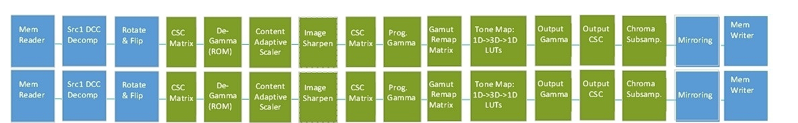
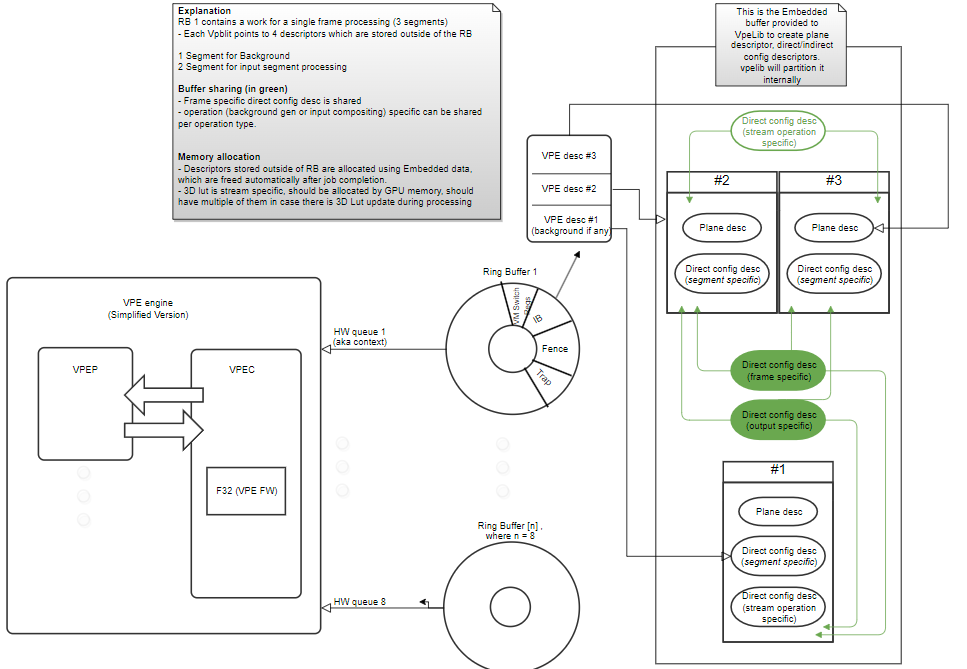

# Video Processor Engine (VPE) High Level Documentation

## Overview

VPE is a hardware pipeline that does baseline video processing from DRAM to DRAM.

The goal of the VPE is to reduce the dependency on graphics engine and therefore saving the graphic engine power. The main functionality of VPE is to process video DRAM in/out.

It is capable of doing pixel re-gamma, scaling, CSC, gamut remap, tone mapping, programmable gamma. Future versions may include more support like blending, mirror and rotation, etc.

There are three implementations of VPE:

1 - Single pipeline (VPE 1.0)


2 - Dual independent pipeline (VPE 1.1)



The VPE hardware is controlled by the VPE driver encapsulated in the VPELIB library.

## VPELIB API

The VPE hardware pipeline is controlled by a dedicated firmware. This firmware expects a series of commands to execute. Commands can be present in Ring buffer, command buffer and embedded buffer.

Ring Buffer at the current implementation stage is maintained by Kernel mode driver (KMD), and ring buffer commands are constructed by KMD. In the future, ring buffer could be owned and ring buffer command will be possible to be owned by the user mode driver.

User Mode Driver (UMD)'s responsibility at the current stage is to construct the command buffer. With VPE engine, the command buffer itself will store a series of VPE descriptor commands, which essentially contain address pointers to other descriptors or other GPU memory (like 3DLUT). The other descriptors, like plane descriptor, config descriptors etc., are located in the embedded buffer.

Once constructed, the vpelib's caller will submit the command buffer to the Engine's queue, KMD will construct the ring buffer command called "Indirect Buffer Command" to point to this command buffer.

Once a Hardware queue is enabled, the VPE Firmware will fetch the commands from the ring buffer one by one and then eventually when it sees the "Indirect command" in the ring buffer, which points to the UMD-constructed command buffer, it will fetch the command buffer content to execute.

The mechanism is presented below:



The main functions of the VpeLib API are:

### vpe_create

```
/** @brief Create the VPE lib instance.
 *
 * Caller provides the current asic info,
 * logging and system memory APIs.
 * It initializes all the necessary resources for the asic
 * and returns the general capabilities of the engines.
 *
 * For capabilities based on conditions,
 * shall be done by vpe->cap_funcs.*
 *
 *
 * @param[in] params  provide the asic version, APIs for logging and memory
 * @return            vpe instance if supported. NULL otherwise
 */
struct vpe *vpe_create(const struct vpe_init_data *params);
```

### vpe_destroy

```
/** @brief Destroy the VPE lib instance and resources
 *
 * @param[in] vpe   the vpe instance created by vpe_create
 */
void vpe_destroy(struct vpe **vpe);
```

### vpe_check_support
```
/**
* @brief Check if the VPE operation is supported.
* 
* Caller must call this to check if the VPE supports
* the requested operation before calling vpe_build_commands().
* If operation is supported, it returns the memory requirement.
* 
* The caller has to prepare those required memories
* and pass them to the vpe_build_commands().
* 
* @param[in]  vpe      vpe instance returned by vpe_initialize()
* @param[in]  param    build params
* @param[out] req      memory required for the command buffer and
  embedded data if return VPE_OK.
  caller has to alloc them and provide it to build_vpbilts API.
* @return VPE_OK if supported
  */
enum vpe_status vpe_check_support(struct vpe *vpe, const struct vpe_build_param *param, struct vpe_bufs_req *req);
```

### vpe_build_commands

 ```
/**
 * @brief Build the command descriptors for the given param.
 * caller must call vpe_check_support() before this function,
 * unexpected result otherwise.
 *
 * @param[in]  vpe      vpe instance created by vpe_create()
 * @param[in]  param    vpe build params
 * @param[in,out]  bufs  [in]  memory allocated for the command buffer, embedded buffer and 3dlut.
 *                             If size is 0, it reports the required size for this checked
 * operation. [out] the next write address and the filled sizes.
 * @return status
 */
enum vpe_status vpe_build_commands(
    struct vpe *vpe, const struct vpe_build_param *param, struct vpe_build_bufs *bufs)
```

This function can be used to query the size requirement of command buffer and embedded buffer by 
setting the buffer size to 0. 

With the proper buffer size, this API will start to construct the command buffer and embedded buffer content.

### vpe_build_noops

```
/**
 * @brief Build the command descriptors for No-Op operation
 * @param[in]      vpe             vpe instance created by vpe_create()
 * @param[in]      num_dwords      number of noops
 * @param[in,out]  ppcmd_space     in: dword aligned command buffer start address
 *                                 out: dword aligned next good write address
 * @return status
 */
enum vpe_status vpe_build_noops(struct vpe *vpe, uint32_t num_dwords, uint32_t **ppcmd_space);
```


# VPE Tutorial - bypass RGB TO RGB

In order to process an input image bypass to output, one has to do the followings:

- establish the input image array
- set the source image dimensions
- set the color space of the input image (RGB)
- create an input texture with the above parameters
- set the source destination dimensions , same like the input size
- set the destination color format  (RGB, same like input)
- Set the linearity of the output the same like the input
- Add alpha channel if that is the case
- trigger the VPBlit which will use the VPE hardware

In order to accomplish the aboves, the caller needs to create an instance of VPE first.

```
struct vpe *vpe_create(const struct vpe_init_data *params);
```

Then check if the created VPE instance supports the given parametrs.

```
enum vpe_status vpe_check_support(
    struct vpe *vpe, const struct vpe_build_param *param, struct vpe_bufs_req *req)
```

The input is of type vpe_build_params which states the parameters for input and output.

```
struct vpe_build_param {
    uint32_t                num_streams;    /**< Number of source streams */
    struct vpe_stream      *streams;        /**< List of input streams */
    struct vpe_surface_info dst_surface;    /**< Destination/Output surface */
    struct vpe_rect         target_rect;    /**< rectangle in target surface to be blt'd.
                                               Ranges out of target_rect won't be touched */
    struct vpe_color    bg_color;           /**< Background Color */
    enum vpe_alpha_mode alpha_mode;         /**< Alpha Mode. Output alpha in the output
                                               surface */
    struct vpe_hdr_metadata   hdr_metadata; /**< HDR Metadata */
    struct vpe_reserved_param dst_reserved_param;    // data flags
    struct {
        uint32_t hdr_metadata : 1;
        uint32_t reserved     : 31;
    } flags;
```

For this example, set num_streams to a one and provide a single stream for the streams parameter.

The destination surface must be populated with these parameters. The most important are the destination address, plane_size, color space and format.

For this example, destination format and color space should be the same as the input format and color space.

```
struct vpe_surface_info {  
    struct vpe_plane_address      address;     /**< Address */
    enum vpe_swizzle_mode_values  swizzle;     /**< Swizzle mode */
    struct vpe_plane_size         plane_size;  /**< Pitch */
    struct vpe_plane_dcc_param    dcc;
    enum vpe_surface_pixel_format format;      /**< Surface pixel format */
    struct vpe_color_space cs;                 /**< Surface color space */
};
```

Plane size should be populated accordingly. As this test is RGB to RGB, ignore the YUV fields.

```
struct vpe_plane_size {
    struct vpe_rect surface_size;    /**< Plane rectangle */
    struct vpe_rect chroma_size;     /**< Chroma plane rectangle for semi-planar YUV formats */
    uint32_t        surface_pitch;   /**< Horizintal pitch alignment of the plane in pixels */
    uint32_t        chroma_pitch;    /**< Horizintal pitch alignment of the chroma plane for
                                        semi-planar YUV formats in pixels */
    uint32_t surface_aligned_height; /**< Vertical alignment of the plane in pixels */
    uint32_t chrome_aligned_height;  /**< Vertical alignment of the chroma plane for semi-planar
                                        YUV formats in pixels */
};
```

For this example, `struct vpe_rect  target_rect` should be identical with the input/output size.

After calling the support call, the caller needs to call
``` enum vpe_status vpe_build_commands(
    struct vpe *vpe, const struct vpe_build_param *param, struct vpe_build_bufs *bufs);
```
with the same parameters provided to the support call to build the command descriptor.

After the job is done and no more jobs for the VPE, call `vpe_destroy(struct vpe **vpe)` to free the allocated memory to the vpe instance.
# Generate API Doxygen Documentation

By Compiling and building VPE with MSVS, the Doxygen documentation of the public API will automatically get generated in VPE_API_manual directory.

To manually generate the Doxygen documentation without building VPE, create a Doxygen config file similar to the current config file stored as [VPEDoxy.in](./docs/VPEDoxy.in) so that the INPUT field points to the [inc](./inc/) directory of VPE, and OUTPUT_DIRECTORY points to a directory to store the generated output. Then run: ` doxygen.exe <path_to_config_file>`
